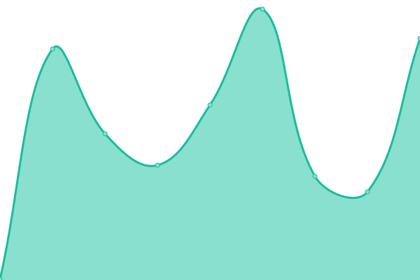
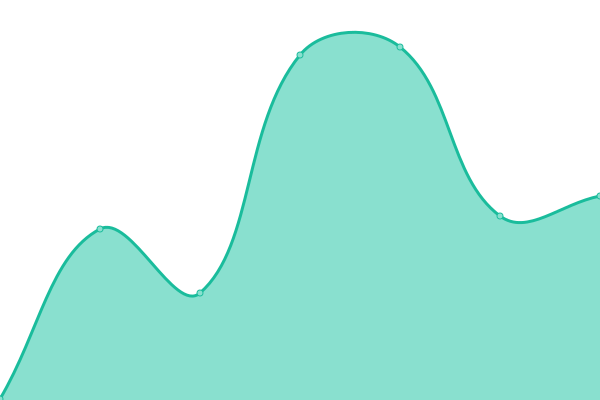
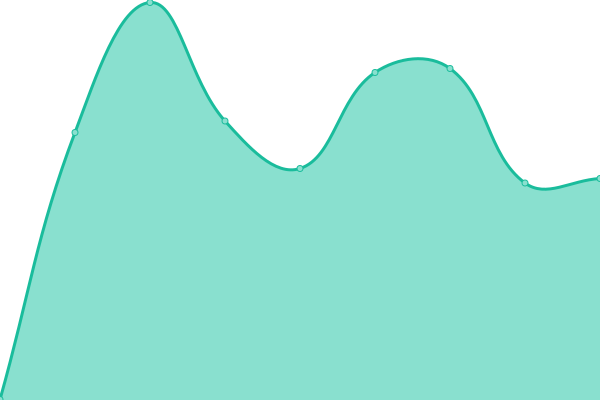

# [📈 Live Status](http://spreadsheets600.is-a.dev/Uptime-Monitor/) : <!--live status--> **🟩 All systems operational**

<!--start: status pages-->
<!-- This summary is generated by Upptime (https://github.com/upptime/upptime) -->
<!-- Do not edit this manually, your changes will be overwritten -->
<!-- prettier-ignore -->
| URL | Status | History | Response Time | Uptime |
| --- | ------ | ------- | ------------- | ------ |
|  [Cooked Roasted Life Backend](https://cooked-roasted-life.onrender.com) | 🟩 Up | [cooked-roasted-life-backend.yml](https://github.com/SpreadSheets600/Uptime-Monitor/commits/HEAD/history/cooked-roasted-life-backend.yml) | 

 213ms
     
 | 

<a href="https://SpreadSheets600.github.io/Uptime-Monitor/history/cooked-roasted-life-backend">99.22%</a>
    

|  [Steam Wrapped](https://steam-wrapped.onrender.com) | 🟩 Up | [steam-wrapped.yml](https://github.com/SpreadSheets600/Uptime-Monitor/commits/HEAD/history/steam-wrapped.yml) | 

 2089ms
     
 | 

<a href="https://SpreadSheets600.github.io/Uptime-Monitor/history/steam-wrapped">99.66%</a>
    

|  [Portfolio ( Personal Website )](https://spreadsheets600.is-a.dev/) | 🟩 Up | [portfolio-personal-website.yml](https://github.com/SpreadSheets600/Uptime-Monitor/commits/HEAD/history/portfolio-personal-website.yml) | 

 221ms
     
 | 

<a href="https://SpreadSheets600.github.io/Uptime-Monitor/history/portfolio-personal-website">100.00%</a>
    

|  [PoraHobe website](http://dono-03.danbot.host:2521) | 🟩 Up | [pora-hobe-website.yml](https://github.com/SpreadSheets600/Uptime-Monitor/commits/HEAD/history/pora-hobe-website.yml) | 

 599ms
     
 | 

<a href="https://SpreadSheets600.github.io/Uptime-Monitor/history/pora-hobe-website">100.00%</a>
    

|  [Frontpage Website](https://frontpage-generator-e5n7.onrender.com/frontpages) | 🟩 Up | [frontpage-website.yml](https://github.com/SpreadSheets600/Uptime-Monitor/commits/HEAD/history/frontpage-website.yml) | 

 1933ms
     
 | 

<a href="https://SpreadSheets600.github.io/Uptime-Monitor/history/frontpage-website">96.88%</a>
    

<!--end: status pages-->

## 📄 License

- Powered by: [Upptime](https://github.com/upptime/upptime)
